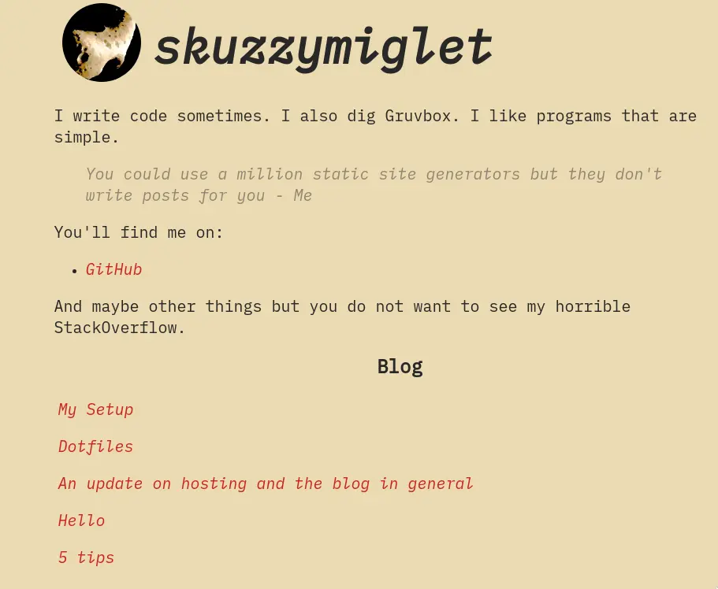

# Make a site easily with `ssg`

I've bundled up some templates, styles and patches to the `ssg5` script (originally by [Roman Zolotarev](https://www.romanzolotarev.com/), article list patch by [notthebee](https://notthebe.ee/)), so you can easily create a minimalistic blog.

You can read [this article](https://skuz.xyz/new-site.html) for more info on the making of these configs, which are still much a work-in-progress.

## Usage

`git clone` this repo somewhere useful.

Modify the _template_ files to your needs, and move them to the correct paths (remove `-template`).
Modify the avatar for yourself.
Add your posts in `src/`
Then you can `deploy.sh` to the internet!

